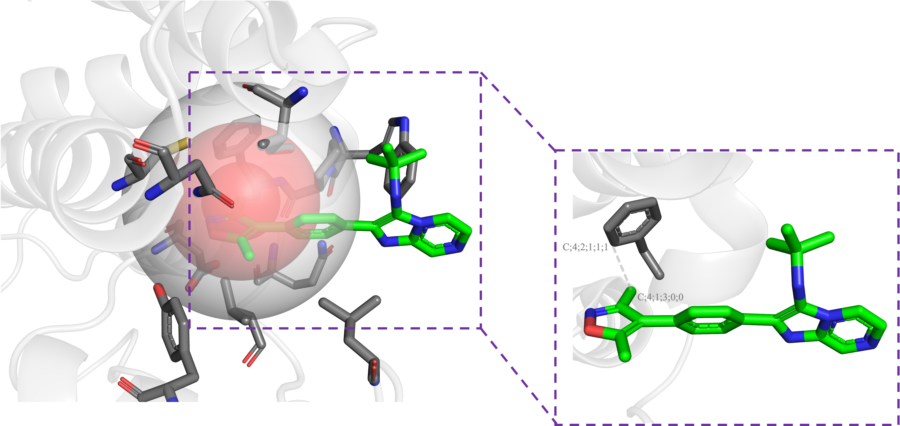

# OnionECIF

OnionECIF is a novel DTA prediction methodology that combines extended connectivity fingerprints with shell models to compute the extended connectivity fingerprints of drugs and proteins at varying shell layers to enable DTA prediction. This approach preserves the atomic environment information of drug targets, captures long and short-range interaction characteristics, and overcomes the challenge of conventional ECIF methods of failing to assess long-range interactions effectively. 

Our experimental results exhibit that by extensively harnessing the benefits of extended connectivity fingerprints and shell models, it efficiently captures the interaction features of drugs and proteins on different spatial scales, leading to excellent performance, with a Pearson similarity index of 0.8722, RMSE of 1.164, MAE of 0.9308, and Spearman of 0.8747. This method outperforms current state-of-the-art methodologies, confirming its apparent advantages. Thus, this approach presents a reliable and effective solution for DTA prediction.


## Contact

Liang Pan, Hunan University, panliang@hnu.edu.cn

Zhijian Xu, Shanghai Institute of Materia Medica, zjxu@simm.ac.cn

Shaoliang Peng, Hunan University, slpeng@hnu.edu.cn

## Getting started
Before running our code, create a [conda](https://conda.io/projects/conda/en/latest/user-guide/getting-started.html "Getting started with conda") environment using the file `conda_env.yml`. To do so, open a terminal and run: ```conda env create -f conda_env.yml```.

Or you can also use pip to install packages.

## Inference
Unzip features.zip and run ```python inference_and_plot.py```.

## In order to train model:

### 1. Prepare the dataset containing the 3D structure of protein-ligand complexes.

You can download CASF-2016, refined-set v2016, refined-set v2019, and general-set v2019 from [PDBbind](http://www.pdbbind.org.cn/ "PDBbind") to include all 9299 complexes showing in `pdbids.txt`.

### 2. Feature extraction.
All ligands were processed using Standardizer, JChem 20.11.0, 2020, ChemAxon to add explicit hydrogen atoms (in case they were missing) and to perceive aromaticity in an interpretable way for RDKit. Replace the data directory in file `generate_features.py` and run ```python generate_features.py shellnum```, shellnum(default 23) is how many shells you want to generate.

### 3. Train via GradientBoostingRegressor.
Change directory in file `get_features.py` and run ```python train_GBT.py```.

### 4. Predict the protein-ligand binding affinity.
Specify your model_file and run ```python inference_and_plot.py```.

## Citation
todo